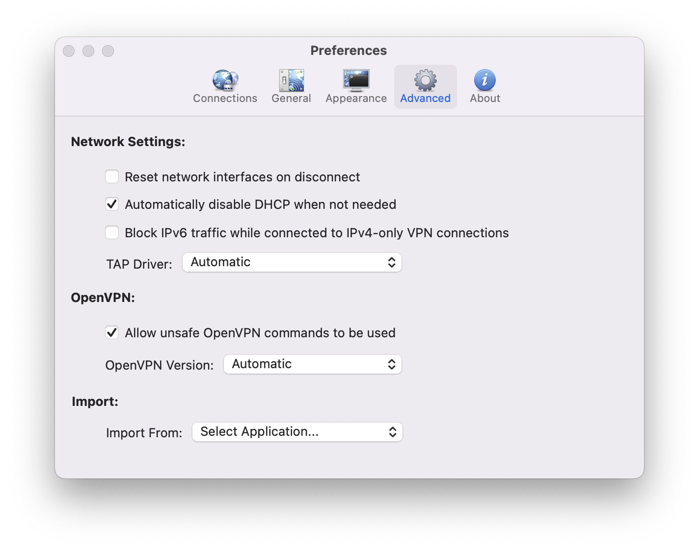

# openvpn-routes
OpenVPN routes script

## Viscosity Configuration on Mac OS

### Configure Viscosity
To get started, you will need to enable the AllowOpenVPNScripts option in Viscosity. To enable this option run the following command in the Terminal (/Applications/Utilities/Terminal) application and enter your administrator details when prompted:

```
/Applications/Viscosity.app/Contents/MacOS/Viscosity -setSecureGlobalSetting YES -setting AllowOpenVPNScripts -value YES
```

Also We need to enable `Allow unsafe OpenVPN commands to be used`


### script installation
Next, you'll need to create a script that will inject routes for Your split-tunneling configuration

```
git clone git@github.com:lgogolin/openvpn-routes.git
cd openvpn-routes
```

```shell
sudo mkdir "/Library/Application Support/ViscosityScripts"
sudo cp routes.py "/Library/Application Support/ViscosityScripts"
sudo chown -R root:wheel "/Library/Application Support/ViscosityScripts"
sudo chmod -R 755 "/Library/Application Support/ViscosityScripts"
```

### edit Viscosity configuration
Now you're ready to add it to your connection in Viscosity. To set the script, edit your connection, go to the Advanced tab, and on a new line add the following command, then click Save:

```
script-security 2
down "/Library/Application\\ Support/ViscosityScripts/routes.py down"
up "/Library/Application\\ Support/ViscosityScripts/routes.py up"
resolv-retry infinite
```


## License

MIT-License. As is. No warranties whatsoever. Mileage may vary. Batteries not included.
